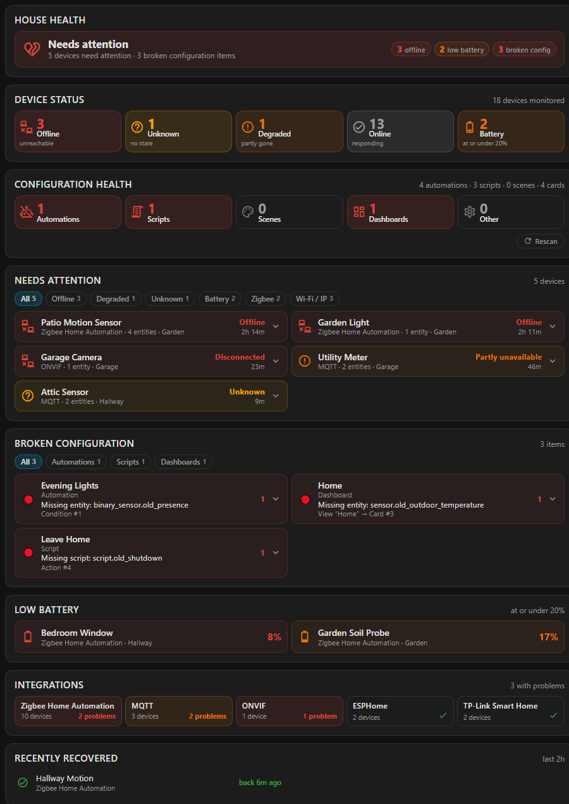
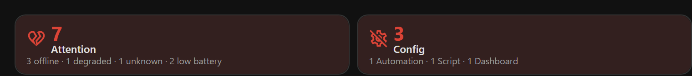
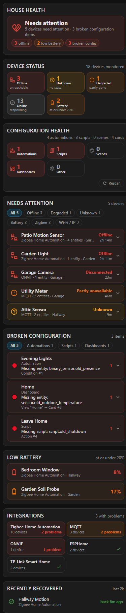

# HA - Device Health view

A Home Assistant card that answers two questions and keeps them strictly apart:
**is anything broken right now**, and **does everything my configuration points at still exist**.



Home Assistant will happily run an automation that references an entity you deleted six months
ago. It fails silently, at three in the morning, and nothing tells you. Meanwhile a sensor that
went offline yesterday looks exactly like one that is merely switched off. This card separates
the two and reports both.

| | Question | Example |
|---|---|---|
| **Runtime health** | is anything unhealthy *right now*? | `sensor.outdoor_temperature` exists but reads `unavailable` — a device problem |
| **Configuration health** | does everything the configuration *points at* still exist? | an automation names `sensor.old_outdoor_temperature`, which was deleted — a configuration problem |

A device card never becomes a broken-automation card, and neither counter ever counts the
other's findings.

Everything comes from Home Assistant's own APIs — the state machine, the entity/device/area
registries, `automation/config`, `script/config`, the scene editor endpoint, `lovelace/config`,
`lovelace/resources` and `get_services`. No third-party integration is installed, queried or
required for any of it, and nothing is ever written: the inspector diagnoses and never repairs.

## Features

- **Device-oriented, not entity-oriented.** One physical device with four unavailable entities
  is one problem, not four. Entities that belong to no device are reported separately.
- **`off` is not a fault.** A light that is off, a cover that is closed, a media player that is
  idle, a person who is `not_home` — none of these are health problems, and the card never
  pretends otherwise.
- **Broken references, found statically.** Automations, scripts, scenes and every Lovelace
  dashboard are walked structurally for references to entities, devices, areas, floors, labels,
  scripts, scenes, helpers, buttons and actions that no longer exist.
- **Conservative by design.** Every finding is `verified`, `warning` or `unvalidated`, and only
  verified findings reach the red counters. A template it cannot resolve is reported as
  unresolvable, never as broken.
- **Two alert tiles** for a main dashboard that show nothing at all when nothing is wrong.
- **Probable shared causes.** When several devices on one integration fail within minutes of
  each other, it says so — and distinguishes that from a Home Assistant restart.
- **Responsive to the card's own width**, not the browser's, so it behaves the same in a narrow
  dashboard column as on a phone.
- **No polling.** Runtime health follows the state machine; the configuration scan runs once and
  repeats only when something it read has actually changed.

## Installation

### HACS (custom repository)

1. HACS → ⋮ → **Custom repositories**
2. URL: `https://github.com/ilirdokle43/HA-Device-Health-View`, type: **Dashboard**
3. Install, then reload your browser.

### Manual

Copy `device-health-card.js` into `config/www/` and add the resource:

```yaml
url: /local/device-health-card.js
type: module
```

## Configuration

### The full page

```yaml
type: custom:device-health-card
```

That is the whole configuration. Everything below is optional.

| Option | Default | What it does |
|---|---|---|
| `mode` | `full` | `full`, `device-compact` or `configuration-compact` |
| `battery_threshold` | `20` | Percent at or under which a battery needs attention |
| `degraded_ratio` | `0.5` | Fraction of a device's entities that must be unavailable before it is "degraded" rather than "offline" |
| `recovery_minutes` | `120` | How long a recovered or deleted device stays listed |
| `ignored_domains` | see below | Domains whose resting state looks like a fault |
| `exclude_integrations` | `[]` | Integrations to leave out entirely |
| `exclude` | `[]` | Regular expressions matched against entity ids |
| `skip_label` | `skip_health_checks` | Label id that marks a device as skipped |
| `exclude_devices` | `[]` | Device ids to skip without using a label |
| `sections` | all | Which sections to render, in order |
| `cluster` | see below | Shared-cause detection thresholds |
| `navigation_path` | none | Path the compact tiles open on tap. Unset, they are readouts and do not react to a tap |

A worked example:

```yaml
type: custom:device-health-card
battery_threshold: 15
exclude_integrations:
  - mobile_app
exclude:
  - '^sensor\..*_uptime$'
cluster:
  window_minutes: 10
  min_devices: 3
```

### The two compact tiles

For a main dashboard, where you normally want to see nothing at all:

```yaml
type: custom:device-health-card
mode: device-compact
navigation_path: /my-dashboard/health
grid_options: { columns: 6, rows: auto }
```
```yaml
type: custom:device-health-card
mode: configuration-compact
navigation_path: /my-dashboard/health
grid_options: { columns: 6, rows: auto }
```



**The pair lives or dies together.** When neither has anything to report, both disappear
completely — not a green card, not a zero, no empty cell; the dashboard closes the space. When
*either* has something, both appear so the row is full width, and the quiet one goes grey.

Set `navigation_path` to wherever you put the full page and a tap will open it. Leave it out and
the tiles are readouts.

Placed on their own, without the other, each tile simply hides itself when it has nothing to
say.

## Skipping a device

Some devices are off on purpose — a desktop shut down when the house is empty, a socket cut
at the wall for the winter — and reporting them as unreachable is noise rather than news.

Expand any device in **Needs attention** and press **Skip**. It leaves the checks
immediately and moves to a **Skipped devices** section, which is hidden entirely while
nothing is skipped. Each row there shows what the skip is currently suppressing, so a device
skipped a year ago that is now genuinely dead is still easy to notice, and an **Un-skip**
button puts it back.

A skipped device leaves the monitored population altogether rather than being counted as
healthy: calling a deliberately powered-off machine "online" would be as wrong as calling it
offline.

The list is stored as a **label on the device registry**, not in the browser, for two
reasons: it is install-wide, so skipping a device at a desk also skips it on every wall
tablet; and it is visible and removable in **Settings → Devices**, so the state is never
trapped inside this card. The label is created the first time it is needed.

That also gives you two other ways in, for a device that is currently healthy and so has no
card to press Skip on: add the label by hand in Settings, or name the device in
`exclude_devices`.

## How runtime health is decided

Health is evaluated per **device**, from that device's *runtime entities*: registry entities
that are not disabled, not hidden, and not in a domain whose bad-looking state is its resting
state — buttons, update entities, notify targets, presence and command surfaces are all
excluded.

| Verdict | Rule |
|---|---|
| **Disconnected** | a `binary_sensor` with `device_class: connectivity` reading `off`, or an entity whose state literally says `offline` / `disconnected` / `unreachable` / `not_connected` / `not_responding` |
| **Offline** | *every* runtime entity of the device is `unavailable` |
| **Degraded** | at least half the runtime entities are `unavailable`, but not all |
| **Unknown** | no runtime entity has a usable value and at least one is `unknown` rather than `unavailable` |

`off`, `not_home`, `idle`, `standby`, `paused`, `closed` and `docked` are never faults. Duration
comes from the earliest `last_changed` among the entities responsible for the verdict.

A device can leave the problem list for two very different reasons, and the device registry is
what tells them apart: still registered means it started answering again (**recovered**, green);
gone from the registry means it was deleted (**deleted**, grey and deliberately uncelebratory).

## The configuration inspector

Read-only. It diagnoses and never repairs, rewrites or deletes anything.

It walks the configuration of every automation, script, scene and dashboard **structurally** — a
string is only a reference because of the key above it, so `example: "switch.foo"` in a script's
field documentation is never mistaken for a call. Every finding carries a confidence:

| | Meaning | Counted as broken? |
|---|---|---|
| **verified** 🔴 | static reference, in a slot that can only hold that kind of object, and the object is in none of the registries | yes |
| **warning** 🟠 | a legitimate explanation exists — the object is disabled, its integration is not loaded, or the reference sits in a block that is switched off | no |
| **unvalidated** ⚪ | the slot holds a template or a runtime variable | never |

An item whose *only* findings are unvalidated never appears on the page at all.

What is checked: entities (naming the domain — "Missing button", "Missing helper", "Missing
script"), devices and entity-registry ids inside device automations, areas, floors, labels,
actions/services, static entity references inside `states()` / `is_state()` / `state_attr()`
templates, Lovelace cards and badges at any nesting depth, custom card registration, and
duplicate Lovelace resource registrations.

Two rules matter more than the rest:

- **An entity is not missing because the state machine has no value for it.** An integration that
  failed to load leaves its entities in the registry. Only an object in neither the state machine
  nor any registry is a candidate.
- **`entity_id` gone while `entity_id_2` exists** is the one rename inference made, because Home
  Assistant creates that suffix itself when re-registering a taken id. Nothing looser is
  attempted.

Expanding a finding gives you somewhere to go: an automation, script or scene opens its
more-info dialog, and a dashboard offers one button per affected view.

### When it rescans

The scan is hundreds of round trips, so it runs once after the page paints and is shared by
every card on the page. It repeats when — and only when — something it read has changed:

| Change | How it is noticed |
|---|---|
| an automation, script or scene added or deleted | the scan signature is the set of those entity ids |
| a dashboard saved | `lovelace_updated` on the event bus |
| an automation saved or reloaded | `automation_reloaded` on the event bus |
| anything else | the **Rescan** button |

None of it polls.

## Layout

```
HOUSE HEALTH           one verdict line: devices, then configuration
DEVICE STATUS          Offline | Unknown | Degraded | Online | Battery
CONFIGURATION HEALTH   Automations | Scripts | Scenes | Dashboards | Other + Rescan
PROBABLE SHARED CAUSE  integration-wide failures and whole-install events
NEEDS ATTENTION        filter chips + one expandable card per problem device
BROKEN CONFIGURATION   filter chips + one expandable card per broken config item
LOW BATTERY            devices at or under the threshold
INTEGRATIONS           every integration with a device, problems highlighted
RECENTLY RECOVERED     devices that came back
RECENTLY DELETED       devices removed from the registry
SKIPPED DEVICES        devices you have told the card to leave alone
ENTITY-ONLY PROBLEMS   device-less helpers and templates, grouped by integration
```

Sections with nothing in them are not rendered, so a healthy install collapses to the summaries,
two green "all good" lines and the integration grid.

<p align="center">
  
</p>

## Known limitations

- **Automations and scripts that are not loaded cannot be inspected.** Home Assistant only serves
  the configuration of an entity that exists, so an automation that failed to set up is reported
  as "failed to load" rather than having its references checked.
- **Editing an automation's contents is invisible** until you press Rescan — nothing in the
  frontend's state changes when a config is rewritten in place.
- **Adding or removing a Lovelace resource needs a browser reload**, which is Home Assistant's
  constraint rather than this card's: a custom element cannot be un-defined in a running page.
- **Recovery tracking has no backend.** The recovered and deleted lists are a diff against a
  snapshot in `localStorage`, so only transitions a browser actually observed are caught. A
  wall tablet that is always on catches nearly all of them; a laptop that is opened once a day
  catches few.
- **Dynamic references are never validated.** `states('sensor.' ~ variable)` is reported as
  unresolvable, and no attempt is made to guess.

## Licence

MIT
